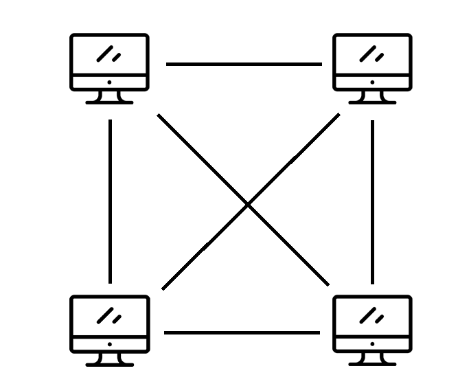

# Peer to Peer chat Specifikáció

A projektem célja egy Peer to Peer chat alkalmazás létrehozása. A lényege az, hogy több gép egy hálózatot alkotva kommunikál egymással,azaz nincs egy központi szerver,ami az üzeneteket továbbítja a klienseknek,hanem minden üzenet közvetlenül megy a feladótól a címzettig.

## A program futásának leírása

1. Konfigurációs fájl betöltése
2. RSA kulcs betöltése vagy létrehozása
3. „Hallgató” socket létrehozása, a hallgatás elindítása
4. Csatlakozás a meghatározott peerekhez
5. Felhasználói felület létrehozása
6. A program fő ciklusának elindítása

### A program kimenete

Minden egyes kiíráskor a program kiírja az aktuális dátumot és időt a következő formátumban:`[ÉÉÉÉ.HH.NN ÓÓ:PP:MM]`

A program ezekben az esetekben ír ki a képernyőre (és mindezt elmenti a `log.txt` fájlba):

1. Inicializáláskor
2. Amikor egy peer csatlakozik
3. Amikor egy üzenet érkezik/el lett küldve 

## Konfigurációs fájl

A konfigurációs fájl arra szolgál, hogy a felhasználó igényei szerint beállíthassa,hogy hogyan működjön a program.Ez a fájl a `config.ini`. Itt a különböző értékek soronként `kulcs=érték` formátumban vannak.

Ha egy sor kettős kereszttel(`#`) kezdődik,akkor azt a program kommentnek veszi.

> Példa:
>
> ```bash
> #Becenév
> nickname=Balazs
> #A program által használt port
> port=6328
> ```

A konfigurációs lehetőségek listája a dokumentációban lesznek elérhetőek.

## Peer to Peer modell

Ahogy már az előbb említettem, a cél egy olyan hálózat kiépítése amiben minden gép csatlakozik az összes többihez.Ennek érdekében szükséges az hogy minden egyes számítógép rendelkezzen egy „hallgató” (listening) socket-el. Ezt a program az indításkor hozza létre.



> Megjegyzés: a program alapértelmezett portja a `6327`

### Csatlakozás más számítógépekhez

Ahhoz hogy egy gép csatlakozhasson egy másikhoz először ismernie kell az IP címét (IPv4) és a portot,amin a program fut. Ezt a `peers.txt` nevű fájlban kell meghatározni,a program ezt az indításkor beolvassa soronként, `ipcím:port` formátumban.

Miután csatlakoztak a  gépek „kezet fognak”,azaz mindkét gép küld magáról egy leírást.A leírás első karakterének kukac karakternek( `@`)kell lennie és tartalmaznia kell egy azonosítót (`id`), a portot amin a program fut(`port`) és egy RSA nyilvános kulcsot(`pubkey`) base64-es karakterkódolásban, amit az üzenetek titkosítására fog majd a program használni.Esetlegesen tartalmazhat egy becenevet(`nickname`) is. A különböző paraméterek AND jellel(`&`), a kulcsok és az értékek egyenlőségjellel(`=`)  vannak elválasztva

> Példa:
>
> ```
> @id=fb55c636c8b513aacab8a46e48109bd2&port=6327&pubkey=LS0tLS1CRUdJTiBQVUJMSUMgS0VZLS0tLS0KTUlHZk1BMEdDU3FHU0liM0RRRUJBUVVBQTRHTkFEQ0JpUUtCZ1FESFYvdW5RUThuR3pVZUI2WGZUaGxPT3NSTgo3S1ZobDJkWGxaK1pFN2t6RTdDNFQyZjNPRFRsNnpqQVNWK1MwR293aHd5Q2g5cUpNYm1ibERORW12eGRCL08rCkFPYzZFYVhGYmhSUEFjajB1c1hZMlF1a1lCMVlwL1IrdWhhRThWTWlYZXFDRGpoek8zT3RKRnpmQnk5ZTNPSk4KdDdGRzh4bU43a0VvekxWWTd3SURBUUFCCi0tLS0tRU5EIFBVQkxJQyBLRVktLS0tLQpc&nickname=ToldiBalazs
> ```

A kézfogást mindig az éppen csatlakozó gép kezdi. A fogadó válaszul ugyanilyen formátumban küldi a válaszát,de tartalmazhatja annak peerjeinek listáját(`peers`). Ezek `ipcím:port`  formátumban vannak vesszővel(`,`) elválasztva. Ha csatlakozó gép ilyet kap válaszul, akkor ezekre megpróbál csatlakozni.

Ha mindez megtörténik akkor mindketten felveszik egymást a peerek listájára.

> Megjegyzés: Ha bármelyik fél valamilyen problémát észlel a kézfogás során akkor küldhet hibaüzenetet is.
>
> Példa: Ha az egyik fél olyan azonosítót(`id`) küld, ami már létezik a listában,akkor egy ilyen üzenetet küld:
>
> ```@valid=false&error=ID_TAKEN```

## Felhasználói felület

A felhasználó böngészőn keresztül érhető el, a HTTP protokollon alapul. Ehhez szükséges létrehozni egy második hallgató socket-et.

> Megjegyzés: a felhasználói felület alapértelmezett portja a `5081`

### Felhasználói felület főoldala

A felület főoldalán a jelenleg csatlakozott peerek, valamint korábbi beszélgető partnerek listáját találjuk.Ha egyik sincs,akkor ezt a program külön üzenettel jelzi.

A felhasználó bármely peer nevére rákattintva elérheti az adott peerel kapcsolatos üzenet oldalát.

Ha bármi változás történik ezekkel az adatokkal kapcsolatban,akkor az oldal automatikusan frissül.

### Üzenet oldal

Itt a felhasználó elolvashatja a korábbi üzeneteit,valamint ha a peer elérhető akkor üzenet is innen küldhető (Valójában nem a böngésző küldi el az üzenetet.Az csak továbbítja a programnak, ami elküldi a címzettnek). 

