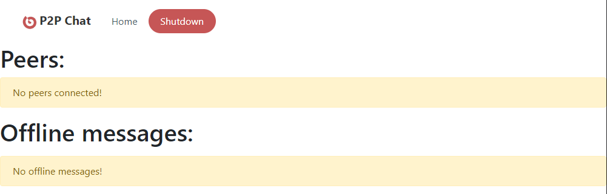
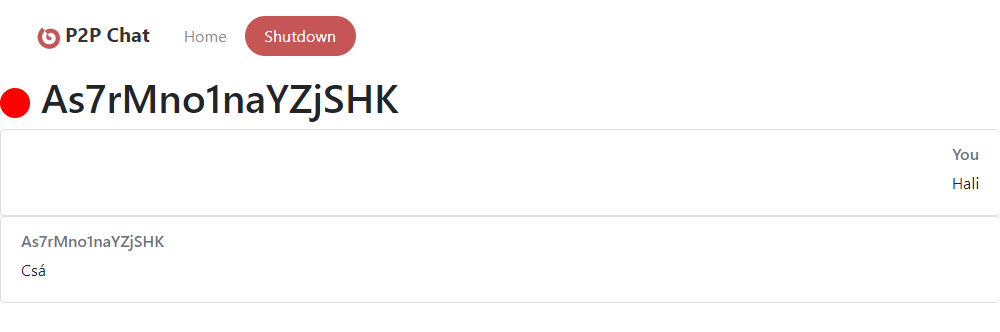

# Felhasználói útmutató {#user-manual}

## Kezdetek
A program első futtatásakor létrejönnek a programhoz szükséges fájlok,de ilyenkor még nem csatlakozik egyetlen géphez sem.
Ehhez ezeknek a gépeknek az IP címét (IPv4) és a portszámot (amin a program fut) meg kell adja a `peers.txt` fájlban, soronként egyet.

Ha a programot újraindítjuk akkor üzenettel jelzi hogy sikerült-e csatlakozni vagy sem.
Például:

  

## Felhasználói felület
A felhasználói felület böngészőből érhető el azon a linken, amit a program indításkor kiír(Alapértelmezetten: `http://127.0.0.1:5081`)
### A felület fejléce
- A `Home` gombra kattintva visszatérhetünk a főoldalra
- A `Shutdown` gombra kattintva kiléphetünk a programból

### Felhasználói felület főoldala
A felület főoldalán a jelenleg csatlakozott peerek, valamint korábbi beszélgető partnerek listáját találjuk.Ha egyik sincs,akkor ezt a program külön üzenettel jelzi.
A felhasználó bármely peer nevére rákattintva elérheti az adott peerel kapcsolatos üzenet oldalát.
Ha bármi változás történik ezekkel az adatokkal kapcsolatban,akkor az oldal automatikusan frissül.



### Üzenet oldal
Itt a felhasználó elolvashatja a korábbi üzeneteit,valamint ha a peer elérhető akkor üzenet is innen küldhető (Valójában nem a böngésző küldi el az üzenetet.Az csak továbbítja a programnak, ami elküldi a címzettnek).



## Konfiguráció
A program a `config.ini` fájlban tárolja a beállításait.

### Elérhető konfigurációs lehetőségek

- `nickname` - Becenév;az azonosító mellett ez is megjelenik.
- `port` - Az a portszám, amin szeretnénk hogy a program fusson.Ennek a portnak a kinyitása erősen ajánlott a program működéséhez.(Alapértelmezett: `6327`)
- `interface-port` - Az a portszám,amin a felhasználói felület futni fog.Kinyitása nem szükséges (Alapértelmezett: `5081`)
- `interface-folder` - Az a mappa ahol a felhasználói felölethez szükséges fájlok vannak tárolva.(Alapértelmezett: `htdocs/`)
- `interface-local` - Ha az értéke `true`, akkor a felhasználói felület csak a programot futtató gépen érhető el.Használata ajánlott.(Alapértelmezett: `true`)

### Példa konfiguráció
```ini
#Becenév
#nickname=Pelda
#A program által használt port (Alapértelmezett: 6327)
port=6327
#Ezne a porton lesz elérhető a felhasználói felület (Alapértelmezett: 5081)
interface-port=5081
#Ebben a mappában vannak tárolva a html fájlok a felhasználói felülethez (Alapértelmezett: htdocs/)
interface-folder=htdocs/
#A felhasználói felület csak ezen a gépen érhető elő (Alapértelmezett: true;Ajánlott)
interface-local=true
```