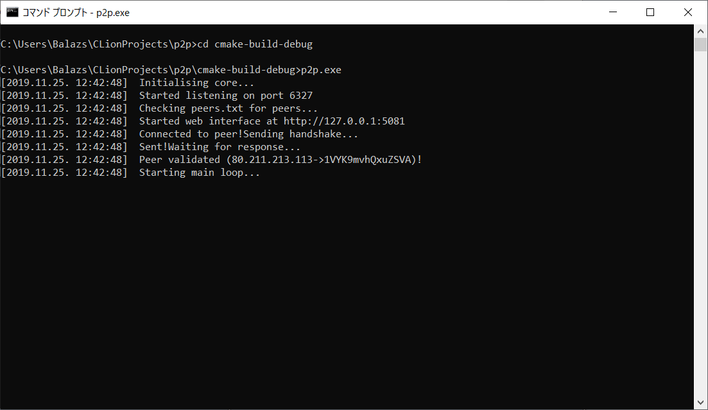

# Felhasználói útmutató {#user-manual}

## Kezdetek
A program első futtatásakor létrejönnek a programhoz szükséges fájlok,de ilyenkor még nem csatlakozik egyetlen géphez sem.
Ehhez ezeknek a gépeknek az IP címét (IPv4) és a portszámot (amin a program fut) meg kell adja a `peers.txt` fájlban, soronként egyet.

Ha a programot újraindítjuk akkor üzenettel jelzi hogy sikerült-e csatlakozni vagy sem.
Például:
  

## Felhasználói felület
A felhasználói felület böngészőből érhető el azon a linken, amit a program indításkor kiír(Alapértelmezetten: `http://127.0.0.1:5081`)
### A felület fejléce
- A `Home` gombra kattintva visszatérhetünk a főoldalra
- A `Shutdown` gombra kattintva kiléphetünk a programból

###Felhasználói felület főoldala
A felület főoldalán a jelenleg csatlakozott peerek, valamint korábbi beszélgető partnerek listáját találjuk.Ha egyik sincs,akkor ezt a program külön üzenettel jelzi.
A felhasználó bármely peer nevére rákattintva elérheti az adott peerel kapcsolatos üzenet oldalát.
Ha bármi változás történik ezekkel az adatokkal kapcsolatban,akkor az oldal automatikusan frissül.
###Üzenet oldal
Itt a felhasználó elolvashatja a korábbi üzeneteit,valamint ha a peer elérhető akkor üzenet is innen küldhető (Valójában nem a böngésző küldi el az üzenetet.Az csak továbbítja a programnak, ami elküldi a címzettnek).
 

